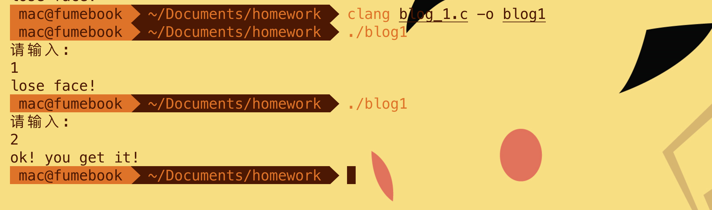

# C语言简明指南

通常而言，国内的软件相关专业，会在第一学期教授 C 语言知识。这里我们对其进行明确的认知：

1. 仅由学院教授的课程，并不能使你完全掌握 C语言，因为学院的C语言课程，虽然是围绕C语言展开，但授课的主要目的是让学生认识编程，换句话说，这堂课换成任何其他语言（如 python php java等）都是一样的，作为学生，你要学会的是这第一学期的课程所教给你的"**编程思想**“。然后请记住：即使你的C语言成绩是满分，也不要对别人说你精通了C语言

2. 学会了 C语言，也只是一个起点，真正要开发一个真正的应用（像游戏、网站、移动端app，或是其他更伟大的事物）还需要很长的路要走。

3. 请把C语言的学习时间压缩在一个月以内。

   注：上文中的 "C语言" 有的指的是学院教授的C语言课程，有的指的是C语言。


## T1-1 引路

让我们对 MOBA类游戏的人物 进行程序化描述（ **双斜杠 // 后面的文字表示注释**）。

```
| - HERO A:
| -- -- 属性 // 英雄有属性，这是数字上的趣味
| -- -- 升级 // 英雄会升级，升级使它更强
| -- -- 释放技能 // 英雄要会技能，不然他就是小兵
| -- -- 死亡 // 英雄会死亡
| -- -- 说台词 // 有时候英雄要说几句台词
```

我们稍微整理一下它的逻辑，如果我们要用C语言来实现它，要怎么写代码呢？请接着看。

```C
struct HERO{
  char *name;  // 英雄之名
  int level;  // 等级
  int group;  //所在阵营
  int health; // 血量
  int magic; // 法力值
  int exp;  // 经验
} HanXin, XiangYu;  //韩信, 项羽

void level_up(){
  // 注意，这里是 编程里的一个重要概念：函数
  // 你肯定在数学里见过函数了
  // 你可以大胆地去把 函数 当成 方式、行动、行为、方法 来理解。
  
  // 这里本应该编写 level up 的具体程序，但它和教程无关紧要，所以我这里进行省略
  // 所以，这是一个只有注释的函数，它是空的。
}

void if_level_up(receive_exp, hero){
  // 英雄每次获取经验的时候，系统怎么知道他要不要升级呢？
  // 解决的方案就是：每当英雄获取经验时，进行一次检查，看看他是否满足升级条件
  // 这里的 if_level_up 函数，就是这样的一个检查方法
  if((receive_exp + hero.exp) > 100){// 这里是 判断条件
    // 如果 接受到的经验 加上 英雄原有的经验 大于 100（我们假设每100点经验升一级）
    level_up();// 调用 level_up 函数，让它去做更具体的升级操作
    hero.exp = 0;// 升级后把英雄的经验条清空
  }
  // 如果 接受到的经验 加上 英雄原有的经验 小于 100
  // 也就是 不满足升级条件
  // 那就什么也不做
}

void die(){
  // 这里本应该编写 die 的具体程序，但是我这里进行省略
  // 所以，这是一个只有注释的函数
}

void if_die(hurt, hero){
  // 英雄每次受到伤害的时候，系统怎么知道他要不要死呢？
  // 解决的方案就是：每当英雄受到伤害时，进行一次检查，看看他是否满足死亡条件
  // 这里的 if_die 函数，就是这样的一个检查方法
  if((hero.health - hurt) < 0){
    // 如果 生命值减去受到的伤害 小于 0
    die();// 调用 die 函数，让它去做更具体的操作
  }
}

```


不知道上面的一串代码能不能引起你的兴趣。

如果你愿意，你可以用编程模拟出一个社会，而不只是游戏的逻辑。

## T1-2 准备

### 你会打字吗？

我知道很多人会打游戏，可是他们不会打字，请不要惊讶，他们可能就在身边，他们使用手写输入法。

关爱计算机文盲，手把手带他们学习用键盘打字。

### 你现在有电脑吗？

如果你是用手机在看这个教程，我必须要请你，请你立刻找到可以使用的电脑，并在电脑上学习。

### T1-2-1 安装学习编程必须的软件

请你安装下面的所有软件：

+ DEV-CPP

+ VScode
+ visual studio 2019

其中，DEV CPP 较为适合新手，菜鸟阶段，我们主要也是使用它。对于 DEV CPP ，请参考这篇文章：[如何正确使用 DEV C++](?md=C/how-to-use-devcpp-in-right-way.md) 


### T1-2-2 阅读《提问的智慧》

如果你不会安装软件，请你立刻询问、求助，**不要犹豫**。

同样的，如果你遇到难题，立刻采取主动措施，**不要犹豫**。

不要犹豫，是为了不浪费你自己的时间。

但是有时候，你无意义的提问或表达不佳的提问，会浪费别人的时间。如果你向别人提问题的方式不正确，别人也**不会犹豫**，不会犹豫就忽视你的问题。

所以请阅读[《提问的智慧》](?md=culture/How-To-Ask-Questions-The-Smart-Way.md)，他会告诉你，什么是程序员的卓越效率以及提问的正确方式。


### T1-2-3 参考其他优秀的C语言教程

ex: [RUNOOB](<https://www.runoob.com/cprogramming/c-tutorial.html>) 是优秀的教程站


## T1-3 起步

```c
#include <stdio.h>
 
int main(){
   /* 我的第一个 C 程序 */
   printf("Hello, World! \n");
   
   return 0;
}
```

很多教程都会给新手看这段代码。

复制它，粘贴到你的IDE里，比如 DEV CPP，对它进行 **编译 链接 执行** ，之后你将会看到你生产出来的简单程序，一个只会在控制台里打印出"Hello, World! \n" 这串字符的程序。

**编译 链接 执行** 是什么，将在另一个文章里说明。

if 如果你无法完成这个步骤，那么不要犹豫，立刻以正确的方式去向学长提问。

else 如果你可以完成这个步骤，那么后面的学习你可以顺利进行了。

###  

### T1-3-1 示范程序A

在程序的世界里，一切都是数。这里我用 购物 举例，这个例子会有些类似于 T1-1 引路中的示例。你可以把 下面的代码粘贴到 IDE 里运行，它是一个完整的程序。

```c
#include <stdio.h>

// 我们知道货物有这样的基本属性，name 和 price
// 我们购物的时候店员会说，这个 name 需要 price 
// 我们购物的时候店员会说，这个 t_shirt 需要 一百元
struct Goods{ // 定义 商品的结构
  char *name;  
  // 商品名
  // char 表示字符，char * 表示数据类型为 char 的指针，这个我们以后会说
  float price;  
  // 价格
  // float 表示浮点型，可以简单理解成精确到小数点后的数，比如说10.1
};

float money_1 = 190.00;
float money_2 = 0.00;
// 声明一个变量，叫做 money_1，表示客户的购买度，它的初始值是 190 元整
// 声明一个变量，叫做 money_2，表示商家赚到的钱，它的初始值是 0 元整

void purchase(struct Goods goods){
  // 定义一个函数/行为，实现 现实中 购买的逻辑
  // void purchase(goods) 的 圆括号 () 中，填这个函数所接受的参数
  // 在现实中，购买是需要指定货物的
  // 所以我们的 purchase 函数也需要接受一个参数goods，来指明购买的商品是哪个
  if(goods.price > money_1){
    // 如果我们要的这个货物大于我们持有的 money
    // 那么就会购买失败
    printf("lose face! \n");
  }else{
    // 否则，购买成功
    printf("ok! you get it! \n");
    money_1 = money_1 - goods.price;// 然后结算一次，买东西当然要花钱了
    money_2 = money_2 + goods.price;// 然后商家也就收到等值的金钱
  } 
}

int main(){
  struct Goods t_shirt_a, t_shirt_b; 
  // 依据商品的结构: struct Goods ，声明两个商品，T恤 A、T恤 B

  t_shirt_a.name = "Graniph";// Graniph 是日本设计T恤品牌
  t_shirt_a.price = 200.00;
  t_shirt_b.name = "Threadless";
  t_shirt_b.price = 180.00;
  // Threadless 是个2000年在芝加哥创立的创意T恤社区网站和品牌，是我的印花T恤启蒙

  int choose_id;
  printf("请输入: \n");
  scanf("%d",&choose_id);
  // scanf 是输入函数，它会得到你从键盘输入的值
  // 我们既然已经有了两个商品，那应该有一个逻辑，是让客户可以选择购买哪一件商品

  if(choose_id == 1){
    // 如果你输入的是 1
    // 调用 purchase 函数，参数是 t_shirt_a, 表示购买对象是 t_shirt_a
    purchase(t_shirt_a);
  }else if(choose_id == 2){
    // 如果你输入的是 2
    purchase(t_shirt_b);
  }
  return 0;
}	
```

得到的运行结果应该是：




其中用到的知识点是：

+ [变量](https://www.runoob.com/cprogramming/c-variables.html)

+ [数据类型](https://www.runoob.com/cprogramming/c-data-types.html) 
+ [判断](https://www.runoob.com/cprogramming/c-decision.html)
+ [函数](https://www.runoob.com/cprogramming/c-functions.html)
+ [作用域规则](https://www.runoob.com/cprogramming/c-scope-rules.html)
+ [输入&输出](https://www.runoob.com/cprogramming/c-input-output.html)
+ [结构体](https://www.runoob.com/cprogramming/c-structures.html) 

如果你无法理解上面的程序，并不妨碍你继续阅读这个教程，不过你应该需要再参考参考 [RUNOOB 的菜鸟教程](https://www.runoob.com/cprogramming/c-tutorial.html) ，有不解的地方立刻以正确的方式询问学长。

按照《提问的智慧》，你应该 先 标明 理清 程序的哪些部分是无法理解的，有的放矢地去寻找答案。


#### T1-3-1-1 第一步

##### 变量

什么是变量? 从字面上看，变量是可变的量；从编程角度讲，变量是用于存储某种/某些数值的存储器。初期我们可以简单地把变量看做一个盒子，这个盒子用来存放数据。

```c
int paper = 60;
```

这里定义了一个名为 paper 的 int 型的变量，它的初始值是 60 。

试卷有 60 张，我们撕掉一张

```c
paper = paper - 1;
```

又发了两张。

```c
paper = paper + 2;
```

试卷翻倍

```c
paper = paper*2;
```

试卷变为三分之一

```c
paper = paper/3;
```

上面的运算表现了一个规则，以这句 `paper = paper - 1;` 为例，等号右边的式子计算后，把值赋予给等号左边的式变量

##### 数据类型

数据类型常用的有这么几种：int, float, char, double

+ int 整形/整数，是单词 integer 的缩写

+ float 单精度浮点数，float-point number

+ double 双精度浮点数

+ char 字符

关于浮点数，可以参考知乎的这个问题：[为什么叫浮点数?](https://www.zhihu.com/question/19848808)


我们再以 paper 为例，它是个整数，令它为 5

```c
int paper = 5;
paper = paper/2;
```

我在程序里令它做除法，变成原来的二分之一，结果会是多少呢？

不是 2.5。

因为 2.5 不是整数，paper 不可能是非int型的值。

我之所以令 paper 为 int 型，是假设它只有整数意义，小数没有意义，即假设 0.5 个 paper 没有意义。

如果你要令 0.5 个paper 具有意义，那么就应该声明 paper 为 float 型变量 或 double 型变量。

更具体的解释请参考：

- [变量](https://www.runoob.com/cprogramming/c-variables.html)

- [数据类型](https://www.runoob.com/cprogramming/c-data-types.html) 


